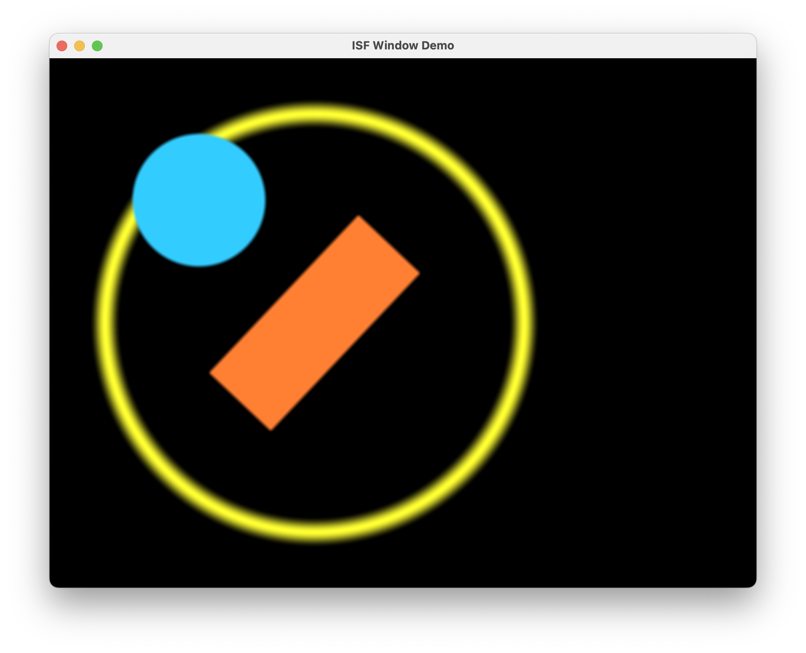

# pyvvisf

Pure Python ISF (Interactive Shader Format) renderer built on PyOpenGL.

[](https://github.com/jimcortez/pyvvisf/actions/workflows/ci.yml)
[](https://pyvvisf.readthedocs.io/)
[](https://pypi.org/project/pyvvisf/)
[](https://pypi.org/project/pyvvisf/)
[](LICENSE)
[](https://github.com/jimcortez/pyvvisf/releases)



pyvvisf parses and renders [ISF](https://editor.isf.video/) shaders from Python — to images or to an interactive window — without any C++ build step. It is a modern, pure-Python alternative to [VVISF-GL](https://github.com/mrRay/VVISF-GL), with enhanced error reporting that mirrors the official ISF online editor's diagnostics. Originally written to power [ai-shader-tool](https://github.com/jimcortez/ai-shader-tool), it gives AI agents (and humans) a way to validate, render, and inspect generated shaders. The majority of code in this repository was built with AI.

[Docs](https://pyvvisf.readthedocs.io/) | [PyPI](https://pypi.org/project/pyvvisf/) | [Issue Tracker](https://github.com/jimcortez/pyvvisf/issues)

## Features

* **Pure Python** — no C++ compilation required
* **Robust ISF parsing** with json5 (comments, trailing commas)
* **Modern OpenGL** via PyOpenGL + GLFW for cross-platform contexts
* **Enhanced error reporting** with Python-native messages and shader context
* **Type-safe metadata** via Pydantic models, with auto-coercion for inputs
* **Multi-version GLSL support** with automatic detection
* **ISF 2.0 compliant** — multi-pass rendering, imports, `IMG_THIS_PIXEL`, `IMG_PIXEL`, `IMG_SIZE`, etc.
* **Context-managed resources** for clean setup and teardown

## Contents

* [Quick Start](#quick-start)
* [FAQ](#frequently-asked-questions-faq)
* [Contributing Guide](#contributing)
* [License](#license)
* [Support](#support)

## Quick Start

See the [docs](https://pyvvisf.readthedocs.io/) for a comprehensive overview.

### Requirements

* Python 3.10+
* A working OpenGL driver (the renderer uses GLFW + PyOpenGL)

### Setup Instructions

Install from PyPI:

```bash
pip install pyvvisf
```

Or install from source for development:

```bash
git clone https://github.com/jimcortez/pyvvisf.git
cd pyvvisf
pip install -e ".[dev]"
```

### Run Instructions

Render an ISF shader to a PNG:

```python
from pyvvisf import ISFRenderer

shader = """
/*{
    "DESCRIPTION": "Every pixel is the selected color.",
    "ISFVSN": "2.0",
    "CATEGORIES": ["Generator"],
    "INPUTS": [
        {"NAME": "color", "TYPE": "color", "DEFAULT": [1.0, 0.0, 0.0, 1.0]}
    ]
}*/
void main() {
    gl_FragColor = color;
}
"""

with ISFRenderer(shader) as renderer:
    renderer.render(512, 512).to_pil_image().save("output_red.png")

    renderer.set_input("color", (0.0, 1.0, 0.0, 1.0))
    renderer.render(512, 512).to_pil_image().save("output_green.png")
```

### Usage Examples

* `examples/isf_renderer_demo.py` — render shaders to images, set inputs, save output
* `examples/isf_window_demo.py` — interactive window display (screenshot above)
* `examples/time_offset_demo.py` — capture frames at arbitrary time offsets

Bundled shaders in `examples/shaders/`:

* `simple.fs` — fills the screen with blue
* `simple_color_change.fs` — single color input
* `simple_color_animation.fs` — fades between two colors over time
* `shapes.fs` — animated moving circle, rotating rectangle, pulsating ring

To pin a specific GLSL version or query what's available:

```python
from pyvvisf import ISFRenderer, get_supported_glsl_versions

print(get_supported_glsl_versions())
renderer = ISFRenderer(shader_content, glsl_version="330")
```

The default is `'330'`. The library compiles a probe shader at construction time to verify compatibility.

### Test Instructions

```bash
pip install -e ".[dev]"
pytest
```

## License

See [LICENSE](LICENSE) — MIT.

## Support

Maintainer: [@jimcortez](https://github.com/jimcortez). For bugs and feature requests, please use the [issue tracker](https://github.com/jimcortez/pyvvisf/issues).

## Acknowledgments

* [VVISF-GL](https://github.com/mrRay/VVISF-GL) — initial reference implementation
* [interactive-shader-format-js](https://github.com/msfeldstein/interactive-shader-format-js) — second reference implementation
* [PyOpenGL](https://github.com/mcfletch/pyopengl) — OpenGL bindings
* [pyGLFW](https://github.com/FlorianRhiem/pyGLFW) — GLFW bindings
